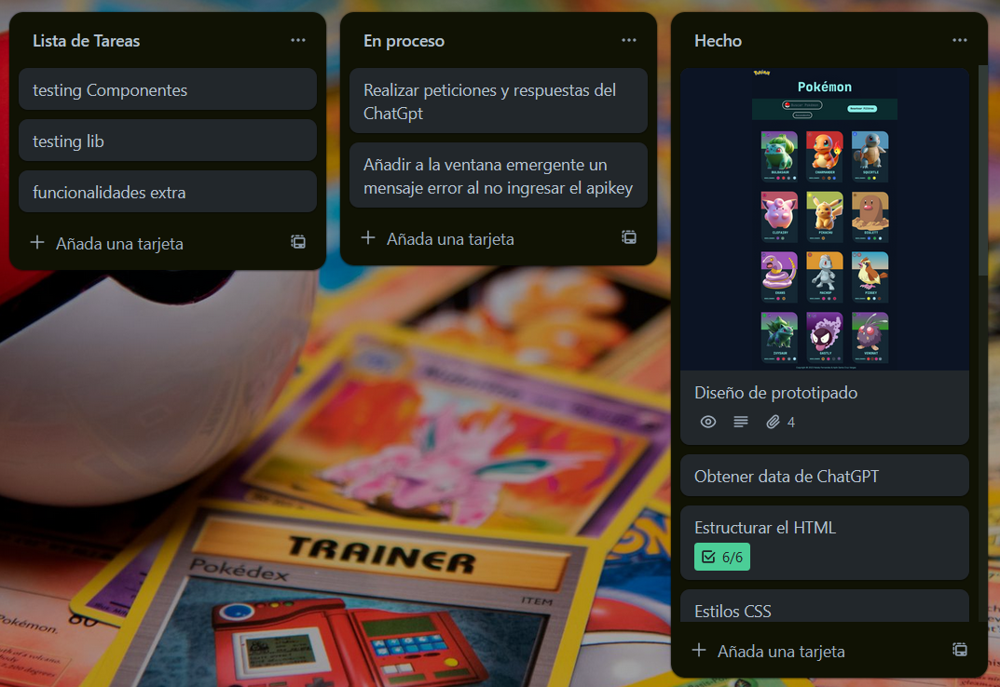
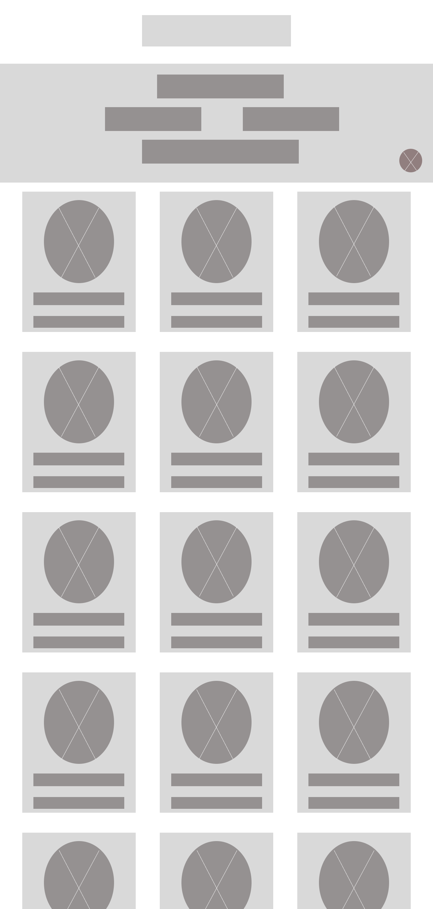
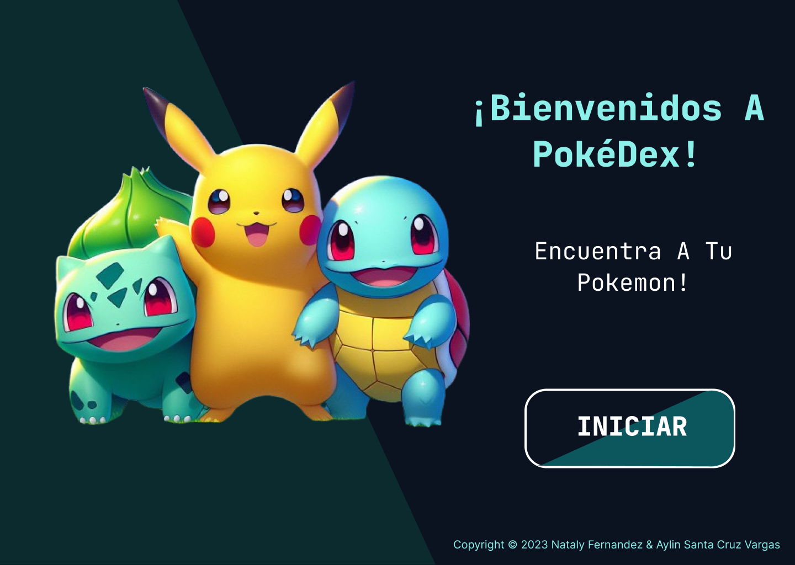
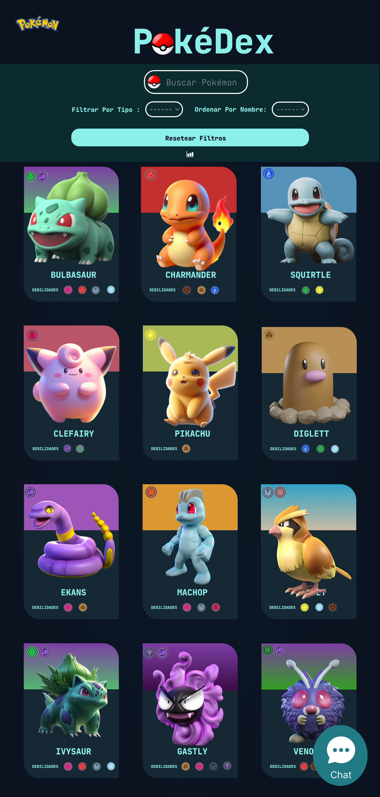

# <div style="display:flex;justify.content:center;align-items:center;"> Pokedex </div>

## Índice

- [1. Resumen del proyecto](#2-resumen-del-proyecto)
- [2. Desarrolladoras Web](#2-desarrolladoras-web)
- [3. Funcionalidades](#3-funcionalidades)
- [4. Estructura del Proyecto](#4-estructura-del-proyecto)
- [5. Tecnologías y Herramientas utilizadas](#5-tecnologías-y-herramientas-utilizadas)
- [6. Prototipos](#6-prototipos)

---

## 1. Resumen del proyecto

El proyecto se enfoca en crear una plataforma web interactiva dedicada al mundo de Pokémon. El objetivo principal es proporcionar a los usuarios una experiencia completa y envolvente donde puedan explorar, aprender y conectarse con el vasto universo de Pokémon de una manera única y emocionante.

Al abordar este proyecto, se tomó un enfoque centrado en el usuario y en la accesibilidad. Se diseñó la interfaz de usuario de manera intuitiva y amigable, permitiendo a los usuarios navegar fácilmente por la plataforma y acceder a la información que desean de forma rápida y eficiente. Se priorizó la experiencia del usuario, asegurándose de que la plataforma fuera accesible en diversos dispositivos y resoluciones de pantalla mediante un diseño responsive.

La página web de Pokémon utiliza una base de datos generada por ChatGPT para proporcionar una amplia gama de información sobre los Pokémon. Los usuarios tienen la capacidad de filtrar y ordenar los Pokémon por tipo, así como realizar búsquedas rápidas para encontrar Pokémon específicos. Además, la plataforma permite a los usuarios navegar entre diferentes vistas con facilidad, incluida una vista detallada que muestra información exhaustiva sobre un Pokémon seleccionado.

## 2. Desarrolladoras web

> :octocat: Aylin Santa Cruz Vargas

- <p>GitHub: <a href="https://github.com/AnthuA25">@AylinSantaCruz</a></p>
- <p>LinkedIn: <a href="www.linkedin.com/in/aylin-santa-cruz-vargas">Aylin Santa Cruz</a></p>

> :octocat: Nataly Fernandez Ovando

- <p>GitHub: <a href="https://github.com/N4T4LY">@Nataly Fernandez</a></p>
- <p>LinkedIn: <a href="https://www.linkedin.com/in/nataly-fdz/">Nataly Fernandez</a></p>

## 3. Funcionalidades

- Consulta de Datos: Accede a una amplia base de datos de Pokémon generada por ChatGPT, que incluye detalles como nombre, tipo, estadísticas y más.

- Filtrado y Ordenamiento: Filtra los Pokémon por tipo y ordénalos según diferentes criterios, como nombre, número en la Pokédex, etc.

- Búsqueda Rápida: Utiliza la función de búsqueda para encontrar rápidamente un Pokémon específico por su nombre o número en la Pokédex.

- Vista Detallada: Al hacer clic en un Pokémon, accede a una vista detallada que muestra información más específica sobre ese Pokémon, como habilidades, movimientos, evoluciones y más.

- Estadísticas por Tipo: Explora estadísticas detalladas sobre los diferentes tipos de Pokémon, incluyendo fortalezas, debilidades y otras características únicas.

- Chat Global: Interactúa con otros entrenadores de Pokémon en el chat global, donde puedes compartir tus experiencias, estrategias y hacer nuevos amigos.

- Chat Individual: Inicia conversaciones privadas con cualquier Pokémon específico para obtener información exclusiva sobre él, como sus preferencias, historias y curiosidades.


## 4. Estructura del proyecto

La lógica del proyecto esta implementada completamente en JavaScript
(ES6), HTML y CSS.

```text
.
├── src
|  ├── components
│  │  └── Cards.js
│  |  └── Filters.
│  |  └── Footer.js
│  |  └── Header.js
│  |  └── InputChat.js
|  ├── data
|  |  └── dataset.js
|  ├── lib
|  |  └── apiKey.js
|  |  └── dataFunctions.js
│  |  └── openAIApi.js
|  ├── views
|  |  └── DetailCard.js
|  |  └── Error.js
|  |  └── GrupalChat.js
|  |  └── Home.js
|  |  └── Welcome.js
|  ├── index.html
|  ├── index.js
|  ├── router.js
|  └── style.css
├── test
|  └── apiKey.spec.js
|  └── dataFunctions.spec.js
|  └── Footer.spec.js
|  └── Header.spec.js
|  └── openAIApi.spec.js
├── README.md
└── package.json

```

## 5. Tecnologías y Herramientas utilizadas

### HTML5

Integramos HTML5 dentro de un componente para mejorar la modularidad y reutilización de código.

#### ModaLApi.js

```js
export const modalApi = () => {
  const modalKey = document.createElement("form");
  const title = document.createElement("h3");
  const input = document.createElement("div");
  const content = document.createElement("a");
  const buttonContainer = document.createElement("div");
  modalKey.setAttribute("class", "modalKey");
  title.setAttribute("class", "titleModal");
  input.setAttribute("class", "containerInput");
  input.innerHTML = `<input type="password" autocomplete="off"/>`;
  content.setAttribute("target", "_blank");
  content.setAttribute("class", "generateApi");
  content.setAttribute("href", "https://platform.openai.com/api-keys");
  buttonContainer.setAttribute("class", "buttonContainer");
  title.textContent = `¡Conversa con tu Pokemones favoritos! Ingresa tu APIKEY y descubre la magia del chat Pokemon.`;
  content.textContent = `No tienes un APIKEY ¡Genera una!`;
  buttonContainer.innerHTML = `<button type="submit" class="cancel">Cancelar</button>
                                <button class="accept">Aceptar</button>`;
  modalKey.append(title, buttonContainer, input, content, buttonContainer);
  return modalKey;
};
```

#### Header.

```js
export const Header = () => {
  const header = document.createElement("header");
  header.innerHTML = `<h1>PkéDex</h1>`;
  return header;
};
```

### CSS

```css
/* La presentación visual y el estilo se lograron con CSS, asegurando una interfaz atractiva y amigable. */
.infoPokemon {
  display: flex;
  flex-wrap: wrap;
  justify-content: center;
  width: 100%;
  height: 100vh;
  margin: 0;
}
```

### JavaScript

```js
// Se implementaron funcionalidades interactivas utilizando JavaScript puro, mejorando la experiencia del usuario.
const searchPokemons = newContainer.querySelector("input[type='text']");
const form = newContainer.querySelector("#formFilters");
form.addEventListener("submit", (e) => {
  e.preventDefault();
  currentData = [];
  const value = searchPokemons.value;
  const findPokemons = data.find((data) => data.name.toLowerCase() === value);
  if (findPokemons) {
    currentData.push(findPokemons);
    newContainer.replaceChild(Cards(currentData), newContainer.children[2]);
    searchPokemons.value = "";
  } else {
    const container = document.createElement("section");
    container.classList.add("container-modal");
    overlay.classList.toggle("overlay-active");
    container.innerHTML = `<i class="fa-solid fa-xmark"></i>
                              
                              <p>Pokemon no encontrado</p>`;
    container.querySelector(".fa-xmark").addEventListener("click", () => {
      container.remove();
      overlay.classList.toggle("overlay-active");
    });
    newContainer.appendChild(container);
    searchPokemons.value = "";
  }
  addImageListeners();
});
```

### Pruebas con Jest

```javascript
// Jest se utilizó para garantizar la calidad y confiabilidad del código.
//Ejemplo ordenamiento descendente y ascendente

describe("SORTDATA", () => {
  it("SORTDATA EXISTS", () => {
    expect(typeof sortData).toBe("function");
  });

  it("SORT ASCENDING", () => {
    const TEST_SORT = [
      { name: "Bulsaur" },
      { name: "Abra" },
      { name: "Caterpie" },
    ];
    const sortBy = "name";
    const sortOrder = "asc";
    expect(sortData(TEST_SORT, sortBy, sortOrder)).toEqual([
      { name: "Abra" },
      { name: "Bulsaur" },
      { name: "Caterpie" },
    ]);
  });
  it("SORT DESCENDING", () => {
    const TEST_SORT = [
      { name: "Bulsaur" },
      { name: "Abra" },
      { name: "Caterpie" },
    ];
    const sortBy = "name";
    const sortOrder = "desc";
    expect(sortData(TEST_SORT, sortBy, sortOrder)).toEqual([
      { name: "Caterpie" },
      { name: "Bulsaur" },
      { name: "Abra" },
    ]);
  });

  it("DATA EMPTY", () => {
    const TEST_SORT = [];
    const sortBy = "name";
    const sortOrder = "asc";

    expect(sortData(TEST_SORT, sortBy, sortOrder)).toBeFalsy();
  });
  it("DATA EMPTY", () => {
    const TEST_SORT = [];
    const sortBy = "name";
    const sortOrder = "desc";

    expect(sortData(TEST_SORT, sortBy, sortOrder)).toBeFalsy();
  });
});
```

### Trello



### Historias de usuario

> Yo como: Entrenar Pokémon.

> Quiero: Poder iniciar una conversación individual con un Pokémon específico,.

> Para: Tener interacciones más personalizadas y profundas con los Pokémon y aprender más sobre sus personalidades y características únicas.

- Definici**ó**n de terminado

  El cliente puede interactuar de manera claro con un pokemon especifico para comenzar una conversación.

- Criterios de aceptación:
  - La aplicación debe proporcionar una opción clara y accesible para iniciar una conversación individual con un Pokémon.
  - Al seleccionar un Pokémon para iniciar una conversación, se debe abrir una interfaz de chat dedicada para esa conversación.
  - El entrenador debe poder enviar mensajes al Pokémon y recibir respuestas en tiempo real.
  - El Pokémon debe responder de manera coherente y apropiada, mostrando su personalidad y características únicas.
  - La conversación individual con un Pokémon debe proporcionar información adicional sobre el Pokémon, como detalles de su historia, habilidades o experiencias pasadas.
  - El chat individual debe ser fácil de usar y navegar, con opciones claras para enviar mensajes, ver mensajes anteriores y cerrar la conversación cuando sea necesario.

### Diseño de la Interfaz de Usuaria

<a href="https://www.figma.com/file/twg4MrXgEyAfpr7BHI7aYH/Data-Pokemon?type=design&node-id=2-3&mode=design&t=hw1y5n8Obi6B9smK-0">Prototipos de Baja y Alta Fidelidad</a>

### Testeos de usabilidad

#### Objetivo

El objetivo de nuestros testeos de usabilidad fue evaluar la facilidad de uso y la eficacia de nuestra aplicación de Pokémon para los usuarios finales. Nos centramos en identificar áreas de mejora en la experiencia del usuario y recopilar comentarios y sugerencias para realizar ajustes en el diseño y la funcionalidad de la aplicación.

#### Tareas Realizadas

- [ X ] Explorar la base de datos de Pokémon y encontrar información sobre un Pokémon específico.
- [ X ] Filtrar Pokémon por tipo y buscar un Pokémon de un tipo específico.
- [ X ] Iniciar una conversación en el chat global y enviar un mensaje.
- [ X ] Iniciar una conversación individual con un Pokémon específico y recibir una respuesta.
- [ X ] Navegar entre las diferentes vistas de la aplicación, incluida la vista de detalle del Pokémon y las estadísticas por tipo.

## 6. Prototipos

### Prototipo de Baja Fidelidad




### Prototipo de Alta Fidelidad




## 7. Conclusión

En el futuro, nos comprometemos a seguir refinando y mejorando nuestra plataforma de Pokedex para garantizar que siga siendo un destino emocionante y gratificante para todos los entrenadores y aficionados de Pokémon. Estamos emocionados por el potencial que tiene nuestra aplicación para seguir creciendo y evolucionando, y esperamos continuar brindando una experiencia excepcional a nuestra comunidad de usuarios.
